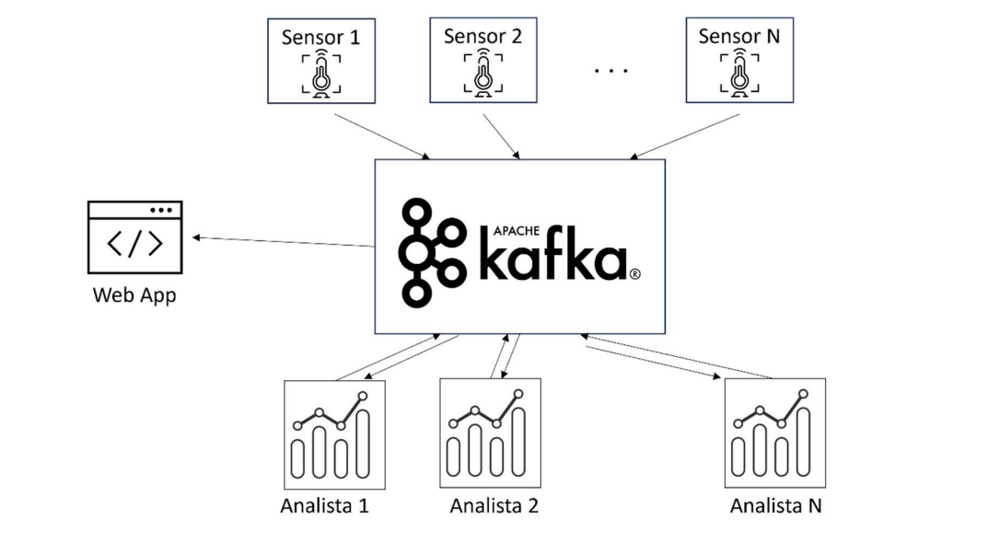

# Sistemas Distribuidos - Aplicação Kafka IoT

Este trabalho da disciplina de Sistemas Operacionais consiste em desenvolver uma aplicação distribuída utilizando o Apache Kafka para um sistema IoT (Internet of Things).

## Instruções

Você deverá ter instalado na sua máquina o Python e Docker. Se já possui o Docker instalado, execute os seguintes comandos em seu terminal para iniciar os contêineres.

```bash
docker-compose up -d --build
```

## Kafdrop

Kafdrop é uma interface web para visualização de tópicos Kafka e navegação em grupos de consumidores. A ferramenta exibe informações como corretores, tópicos, partições, consumidores e permite visualizar mensagens.

Você pode ter acesso ao Kafdrop fazendo um acesso via navegador no endereço http://localhost:19000.

## Arquitetura

A aplicação segue a seguinte arquitetura:


